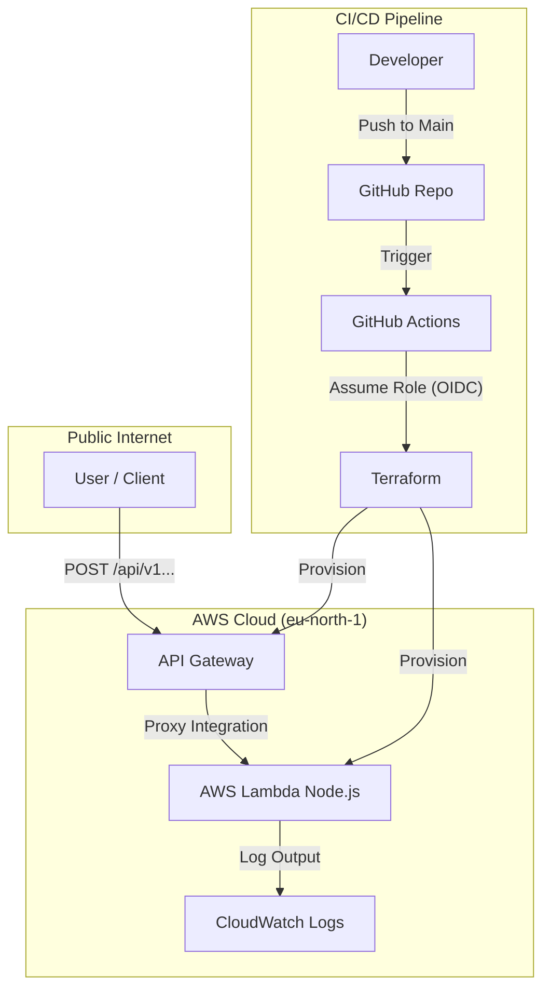

# Find Optimal Time Slot Backend API

This repository contains the backend implementation for the "Find Optimal Time Slot" application. It provides a REST API that processes meeting participant availability and determines the optimal time slots for maximum attendance.

The project includes:

- **Source Code:** TypeScript (Node.js) running on AWS Lambda.
- **Infrastructure as Code:** Terraform to provision AWS resources.
- **CI/CD:** GitHub Actions for automated testing and deployment.

## Architecture

The solution utilizes a serverless architecture on AWS to ensure scalability and zero idle costs.



---

## CI/CD & Deployment

This project uses **GitHub Actions** for continuous integration and deployment. The pipeline is triggered automatically on pushes to the `main` branch, with additional manual dispatching required for *terraform apply* to be run.

### Prerequisites

- **GitHub Secrets:** The repository is configured with an `AWS_ROLE_ARN` secret that allows GitHub to authenticate with AWS via OIDC.

- **Terraform State:** The remote state and locking bucket has been pre-provisioned (see Appendix).

### Deployment Workflow

1. **Commit & Push:** Push changes to the `main` branch.
2. **Validation:** The pipeline runs `npm test` and `npm run build`.
3. **Infrastructure:** Terraform plans changes to the AWS infrastructure. For Terraform to apply the changes, dispatch the workflow manually after confirming desired changes in plan output.
4. **Output:** Upon success, the pipeline logs (Terraform Output) will display the public **API Endpoint URL**.

---

## How to Run & Use

### Local Development

To run tests, build the project, and check Terraform plan locally:

```bash
# Install dependencies
npm ci

# Run Unit Tests (Logic & Handler)
npm test

# Build the project (TypeScript -> JavaScript bundle)
npm run build

# Run Terraform Plan
cd infra
terraform init
terraform plan
```

> **Note:** Because this project uses a remote S3 backend for state, running `terraform plan` locally requires valid AWS credentials. Ensure you have exported `AWS_ACCESS_KEY_ID` and `AWS_SECRET_ACCESS_KEY` (or configured a profile via `aws configure`) for e.g. an IAM User with permissions to read/write to the S3 state bucket.

### Sending a Request

Once deployed, you can interact with the API using `curl` or any HTTP client.

**Endpoint:** `POST https://<api-id>.execute-api.eu-north-1.amazonaws.com/prod/api/v1/meetings/optimize`

*(Note: The exact URL is available in the GitHub Actions Terraform Output).*

**Example Request:**

```bash
curl -X POST <YOUR_API_URL> \
  -H "Content-Type: application/json" \
  -d '{
    "meetingName": "Super Cool Secret Meeting",
    "participants": [
      {
        "name": "Alice",
        "preferredSlots": ["2025-01-01T09:00", "2025-01-01T10:00"]
      },
      {
        "name": "Bob",
        "preferredSlots": ["2025-01-01T10:00"]
      }
    ]
  }'
```

**Expected Response:**

```json
{
  "meetingName": "Design Sync",
  "optimalSlots": [
    {
      "slot": "2025-01-01T10:00",
      "participants": ["Alice", "Bob"]
    }
  ],
  "maxParticipants": 2
}
```

---

## Appendix: Infrastructure Bootstrapping Log

**Note:** The following commands document the manual steps taken to bootstrap the AWS environment (creating the Terraform backend and OIDC permissions). **These resources are already created.** These commands are listed here solely for documentation and troubleshooting purposes.

**Account ID Reference:** `<AWS_ACCOUNT_ID>`

### 1. Terraform Backend (S3 State)

The S3 bucket for remote state storage was created with versioning enabled to prevent state corruption.

```bash
aws s3 mb s3://find-optimal-time-slot-terraform-backend --region eu-north-1

aws s3api put-bucket-versioning \
  --bucket find-optimal-time-slot-terraform-backend \
  --versioning-configuration Status=Enabled
```

### 2. GitHub Actions OIDC Trust

An OpenID Connect provider and IAM Role were created to allow GitHub Actions to deploy without long-lived access keys.

**Identity Provider Creation:**

```bash
aws iam create-open-id-connect-provider \
  --url [https://token.actions.githubusercontent.com](https://token.actions.githubusercontent.com) \
  --client-id-list sts.amazonaws.com
```

**Deployment Role Creation:**

```bash
aws iam create-role --role-name GitHubActionsWorkflowRole --assume-role-policy-document '{
  "Version": "2012-10-17",
  "Statement": [
    {
      "Effect": "Allow",
      "Principal": {
        "Federated": "arn:aws:iam::<AWS_ACCOUNT_ID>:oidc-provider/token.actions.githubusercontent.com"
      },
      "Action": "sts:AssumeRoleWithWebIdentity",
      "Condition": {
        "StringEquals": {
          "token.actions.githubusercontent.com:aud": "sts.amazonaws.com",
          "token.actions.githubusercontent.com:sub": "repo:EddieFin/find-optimal-time-slot:ref:refs/heads/main"
        }
      }
    }
  ]
}'
```

**Permission Policy (Attached to Role):**
This policy grants the runner permission to access the state bucket and manage the application resources.

```bash
aws iam create-policy --policy-name GitHubActionsWorkflowPolicy --policy-document '{
  "Version": "2012-10-17",
  "Statement": [
    {
      "Effect": "Allow",
      "Action": "s3:ListBucket",
      "Resource": "arn:aws:s3:::find-optimal-time-slot-terraform-backend"
    },
    {
      "Effect": "Allow",
      "Action": ["s3:GetObject", "s3:PutObject"],
      "Resource": "arn:aws:s3:::find-optimal-time-slot-terraform-backend/terraform.tfstate"
    },
    {
      "Effect": "Allow",
      "Action": ["s3:GetObject", "s3:PutObject", "s3:DeleteObject"],
      "Resource": "arn:aws:s3:::find-optimal-time-slot-terraform-backend/terraform.tfstate.tflock"
    },
    {
      "Effect": "Allow",
      "Action": ["lambda:*", "apigateway:*", "logs:*"],
      "Resource": "*"
    },
    {
      "Effect": "Allow",
      "Action": [
        "iam:CreateRole", "iam:DeleteRole", "iam:GetRole", "iam:TagRole",
        "iam:PassRole", "iam:AttachRolePolicy", "iam:DetachRolePolicy",
        "iam:ListRolePolicies", "iam:ListAttachedRolePolicies"
      ],
      "Resource": "arn:aws:iam::<AWS_ACCOUNT_ID>:role/find-optimal-time-lambda-role"
    }
  ]
}'

aws iam attach-role-policy \
  --role-name GitHubActionsWorkflowRole \
  --policy-arn arn:aws:iam::<AWS_ACCOUNT_ID>:policy/GitHubActionsWorkflowPolicy
```
